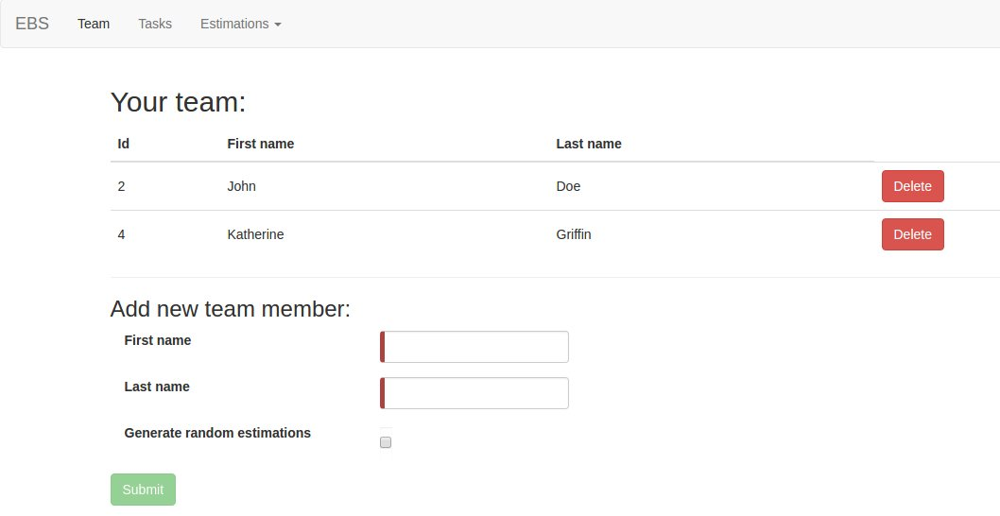
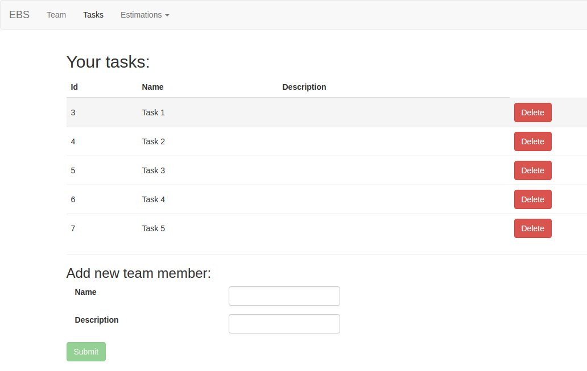
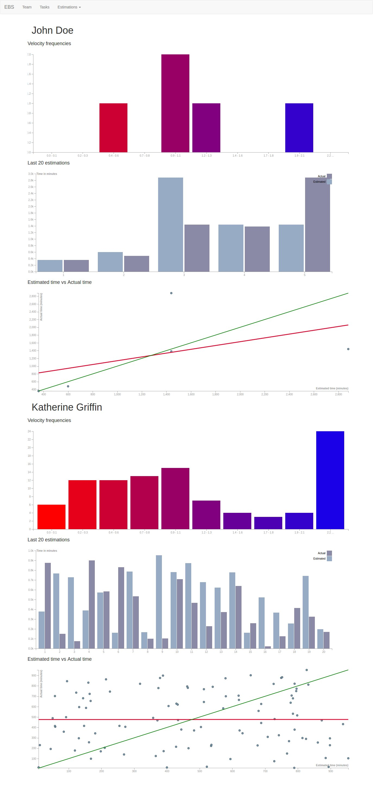
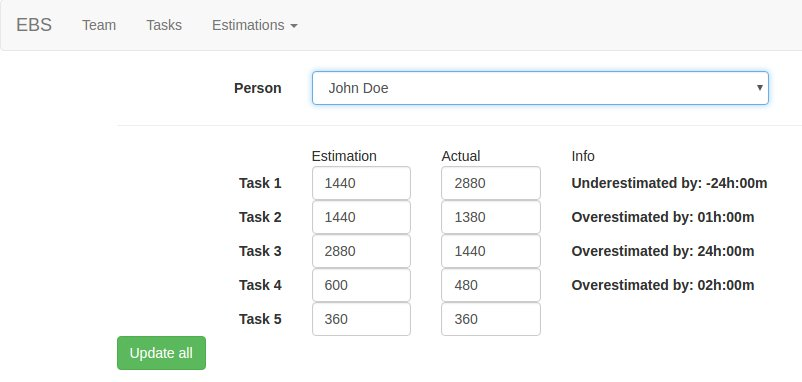
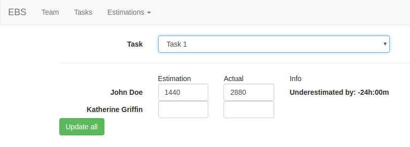

# Evidence Based Scheduling
Small tool to help with scrum task estimations using Evidence Based Scheduling (described on [www.joelonsoftware.com](https://www.joelonsoftware.com/2007/10/26/evidence-based-scheduling))

## Technologies used
- [Spring Boot](https://projects.spring.io/spring-boot/)
- [Angular 2](https://angular.io/)
- [MySQL](https://www.mysql.com/)

## Demo
Requirements:
- Docker images require 8081 and 8083 ports, so those ports must be not used.

Steps to run demo:
1. Clone repo
2. `cd docker-demo`
3. `docker-compose up -d`
4. Open [localhost:8081](http://localhost:8081) page.

## Screenshots
### Team page

### Tasks page

### Estimations pages
#### Team stats

#### Estimations by person

#### Estimations by task

